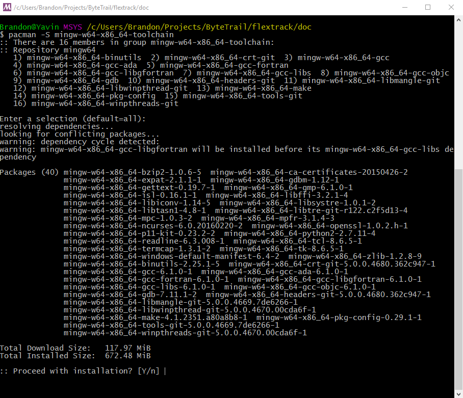
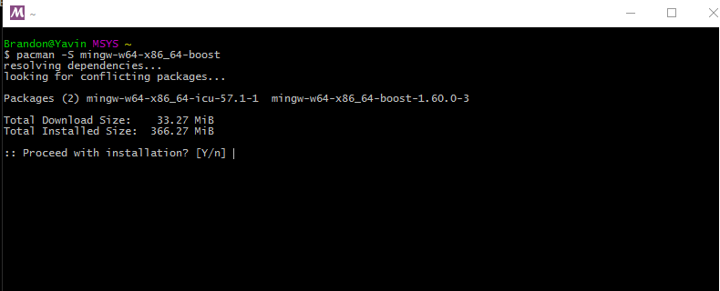

# flextrack
Flextrack Testbed Application 

The is a "testbed" application used to validate basic concepts associated with the design and implementation 
of model railroad flex-track for use in the railfan model railroad modelling application. 

This is being developed in C++ using the gtk-3.0 and gtkmm libraries. The boost C++ unit test framework will be used
to develop any unit test associated with the project.

The C++ coding style guidelines are a modified version of the Google style guidelines for C++. These coding style 
guidelines will be published once complete.

## Building
flextrack supports a cross platform build on Windows and Linux. It has be built on Desktop Ubuntu 16.04 64bit and Windows 10 with MSYS2 and MinGW x86_64.

### Windows
The Windows build environment is based on [MSYS2](https://msys2.github.io/) and MinGW. You will need to download and install the MSYS2 environment and MinGW dependencies if you have not already done so. 

1. Download and install [MSYS2](https://msys2.github.io/).
2. Follow the installation and update instructions on the [download page](https://msys2.github.io/)
3. Once you have updated the MSYS2 installation you will need to install the build dependencies. Typically this is done using the pacman tool that you used to update the MSYS2 installation. These tools are installed in the MSYS2 environment, not the native Windows environment so even if you have the native Windows version of some of these tools installed you will need to follow the instructions below.
4. Install the MinGW build toolchain using the pacman tool:

   `pacman -S mingw-w64-x86_64-toolchain`

5. Install the BOOST libraries :

     `pacman -S mingw-w64-x86_64-boost`
     

     

6. Install CMake:
7. Install Make:
8. Install Doxygen:
9. If you have not already then install git
10. Create a build directory

   `mkdir build`
   `cd build`
   
11. Create Code::Blocks Unix Build files
   
    `cmake -G "CodeBlocks - Unix Makefiles"`

### Linux

